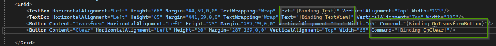

= PocWpfMVVMCSharp Worklog
Doc Writer <christian.popescu@outlook.com>
v 1.0, 2022-12-17
:sectnums:
:toc:
:toclevels: 5
:pdf-page-size: A3

== 17/12/2022 Project creation

Commands:

    dotnet new sln --name PocWpfMvvm

    dotnet new wpf --name WpfApplication

    dotnet sln add WpfApplication\WpfApplication.csproj

Project contents:

    D:\ccp_wrks\Poc\09-PocWpfMVVMCSharp\src>tree /f

    D:.
    \---PocWpfMvvm
    |   PocWpfMvvm.sln
    |
    \---WpfApplication
    |   App.xaml
    |   App.xaml.cs
    |   AssemblyInfo.cs
    |   MainWindow.xaml
    |   MainWindow.xaml.cs
    |   WpfApplication.csproj
    |
    +---bin
    |   \---Debug
    |       \---net7.0-windows
    \---obj
    |   project.assets.json
    |   WpfApplication.csproj.nuget.dgspec.json
    |   WpfApplication.csproj.nuget.g.props
    |   WpfApplication.csproj.nuget.g.targets
    |
    \---Debug
    \---net7.0-windows
    |   .NETCoreApp,Version=v7.0.AssemblyAttributes.cs
    |   App.g.i.cs
    |   apphost.exe
    |   MainWindow.g.i.cs
    |   WpfApplication.assets.cache
    |   WpfApplication.csproj.BuildWithSkipAnalyzers
    |   WpfApplication.csproj.FileListAbsolute.txt
    |   WpfApplication_MarkupCompile.i.cache
    |   WpfApplication_xwlyrr05_wpftmp.AssemblyInfo.cs
    |   WpfApplication_xwlyrr05_wpftmp.AssemblyInfoInputs.cache
    |   WpfApplication_xwlyrr05_wpftmp.assets.cache
    |   WpfApplication_xwlyrr05_wpftmp.csproj.BuildWithSkipAnalyzers
    |   WpfApplication_xwlyrr05_wpftmp.GeneratedMSBuildEditorConfig.editorconfig
    |
    +---ref
    \---refint

== 19/10/2022

The issue with the precedent approach is that I have no control on *Application* object.
All is generated by XAML.

== 20/12/2022

Finaly I can managed it.

Main points:

* Create a View Model that implements INotifyPropertyChanged interface

* Create an internal class that inmplements IComand interface and executes an action (Action Delegate).
[source,c#]
----
        /// 

        /// Transform - Used for command button
        /// Exectue action when button pressed
        /// 

        private class Transform : ICommand
        {
            private Action _action;
            public Transform(Action action)
            {
                _action = action;
            }

            public event EventHandler? CanExecuteChanged;

            public bool CanExecute(object? parameter)
            {

                return true;
            }

            public void Execute(object? parameter)
            {
                _action();
            }
        }
----

* Add properties for fields and Commands for button

[source,c#]
----
    private string _text;
        private string _textView;
        private Transform _transformText;
        private Transform _clearView;
        public event PropertyChangedEventHandler? PropertyChanged;

        public MainWindowModel()
        {
            _transformText = new(TransformAction);
            _clearView = new(ClearAction);
        }

        public ICommand OnTransformButton
        {
            get { return _transformText; }
        }

        public ICommand OnClear
        {
            get { return _clearView; }
        }
        public string Text
        {
            get { return _text; }
            set { _text = value; OnPropertyChanged(); }
        }

        public string TextView
        {
            get { return _textView; }
            set { _textView = value; OnPropertyChanged(); }
        }
----

* Add model to the view

[source, c#]
----
   /// 

    /// Interaction logic for MainWindow.xaml
    /// 

    public partial class MainWindow : Window
    {
        private MainWindowModel theModel = new();
        public MainWindow()
        {
            InitializeComponent();
            this.DataContext= theModel;
        }
    }
----

* Bind properties and commands

