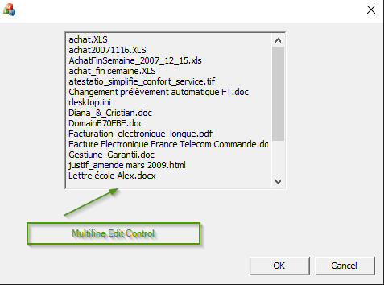

= 22-PocCppStaticLibConsoleAndMFC
Doc Writer <christian.popescu@outlook.com>
v 1.3, 2023-11-10
:sectnums:
:toc:
:toclevels: 5
:pdf-page-size:A3

== Introduction

The purpose is to create a static library in C++ accessible from console application and MFC application.

https://learn.microsoft.com/en-us/cpp/build/walkthrough-creating-and-using-a-static-library-cpp?view=msvc-170[Microsoft Documentation]

Steps:

* Create Static Library Project (Visual Studio)

* Create Console Application (Visual Studio)

* Parameter console application to link to the static library (see image).

image::img/link_static_libary.png[]

* Create MFC Project of type dialog

* Link the static library as for the console application

=== Key points for MFC linked to static library

* Add member function that corresponds to control.

* Link between control and member added in DoDataExchange.

* Fill the field from the static library and refresh the window.

