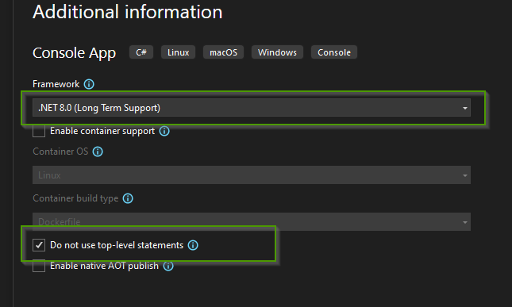

= 23-PocWinFormNetCoreCSharp
Doc Writer <christian.popescu@outlook.com>
v 1.3, 2023-11-10
:sectnums:
:toc:
:toclevels: 5
:pdf-page-size: A3

== Introduction

Create solution Win Form Net Core without "wizards".

The purpose is:

* To allow to create simple applications without wizards that are used to deliver GUI pour tools.
* To create simple Forms that could be used in other applications

== Steps

.  Create project Console C# Net Core
+

+
with the following settings
+

+
. Change the project settings
+

+
. Change the program file as indicated

Note: Use a form created as Windows.Form

[source, C#]
----
using System.Windows.Forms;

namespace PocWindowsFormCSharp
{
    internal class Program
    {
        [STAThread()]
         static void Main(string[] args)
        {
             Form form = new FormOkCancel();
             form.ShowDialog();
        }
    }
}
----